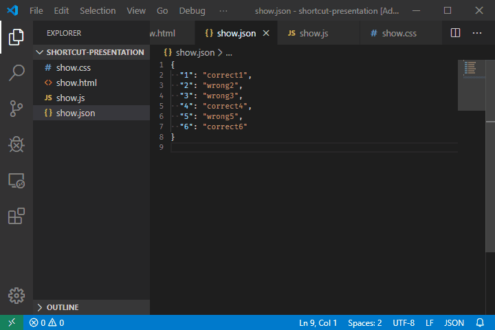
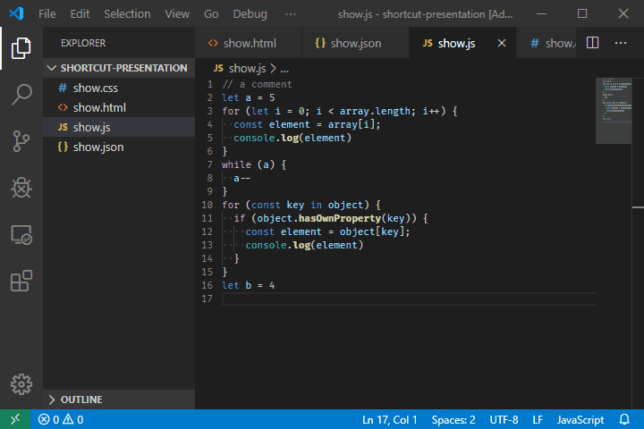
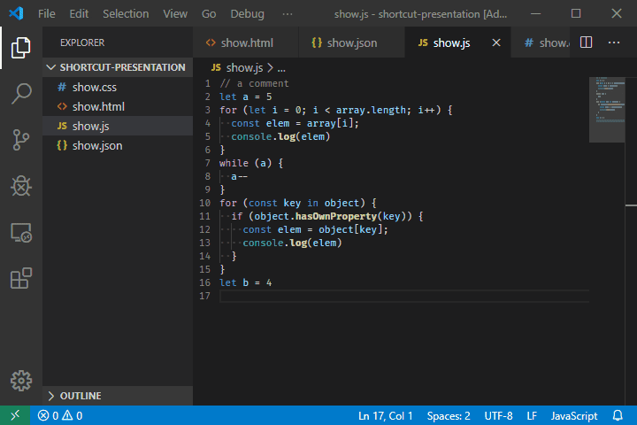
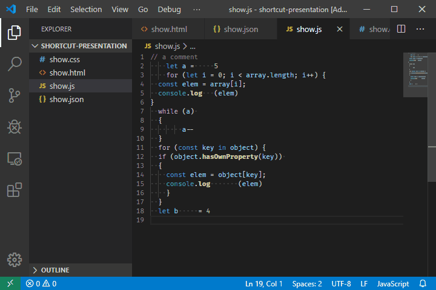

## Поместить курсор в конец каждой выделенной строки: Shift + Alt + I

https://tproger.ru/translations/useful-hotkeys-for-vs-code/

## Выделить все вхождения текущего выделения: Ctrl + Shift + L

## Выделить все вхождения текущего слова: Ctrl + F2

## Подсказки по параметрам: Ctrl + Shift + Space

## Форматировать документ: Shift + Alt + F

