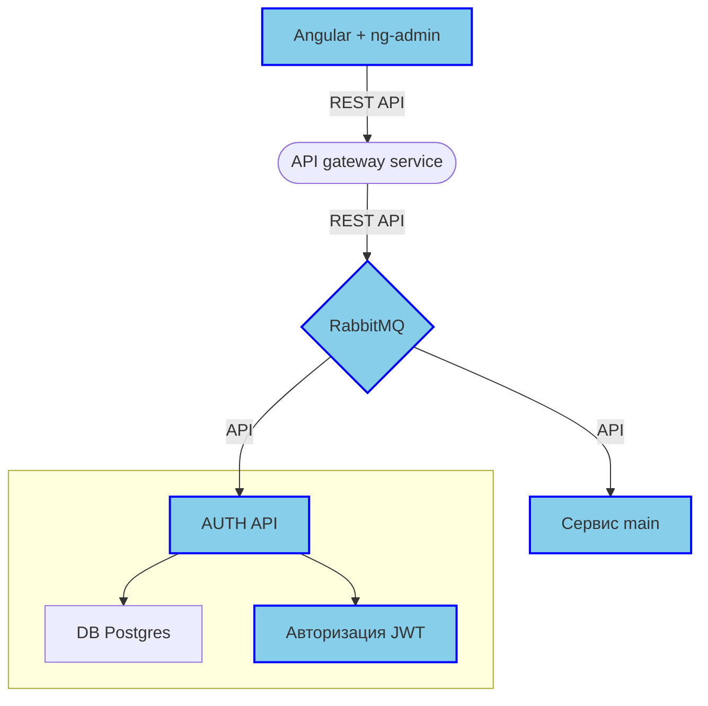

```mermaid 
graph TD
    classDef class1 fill: skyblue, stroke: blue, stroke-width:2px

    A[Angular + ng-admin]:::class1
    B{RabbitMQ}:::class1
    E[AUTH API]:::class1
    F([API gateway service])
    G[DB Postgres]
    C[Авторизация JWT]:::class1 
    A-->|REST API| F
    F-->|REST API| B
    B--API-->E
    subgraph  
    E --> G
    E --> C
    end
    B--API-->D[Сервис main]:::class1
	click C "http://www.github.com" _blank
```
[API](../Сервисы/Авторизация/API.md)

